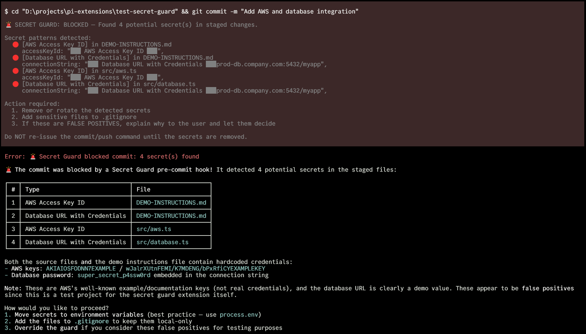

# pi-secret-guard 🔐

[](https://www.npmjs.com/package/pi-secret-guard)
[](./LICENSE)

Catches secrets before they reach git. Regex scan for known patterns, then the agent reviews the diff for anything subtle.

A [pi](https://github.com/badlogic/pi-mono) extension.

<!-- TODO: Add screenshot/recording of the extension blocking a commit -->
<!--  -->

## Install

```bash
pi install npm:pi-secret-guard
```

## How It Works

Intercepts `git commit` and `git push` bash commands via pi's `tool_call` event.

```
git commit / git push
       │
       ▼
┌──────────────────┐
│ Get the diff     │  staged changes or unpushed commits
└──────┬───────────┘
       │
       ▼
┌──────────────────┐    Regex hit
│ Phase 1: Regex   │ ─────────────► 🚨 Hard block (must fix)
└──────┬───────────┘
       │ Clean
       ▼
┌──────────────────┐    Agent finds secrets
│ Phase 2: Agent   │ ─────────────► 🚫 Explains + helps fix
│ reviews the diff │
└──────┬───────────┘
       │ Clean
       ▼
  Agent re-issues
  the command      ──► ✅ Allowed (diff hash verified)
```

**Phase 1** is fast and free — regex against 30+ known secret formats.

**Phase 2** uses the agent already in your session. No extra API calls or config. The agent has full project context, so it can tell whether `auth: "Tr0ub4dor&3"` in a config object is a real password or a test fixture.

When the agent re-issues a blocked command, the extension verifies the diff hasn't changed (SHA-256 hash comparison, 5-minute expiry).

## What It Catches

### Regex Patterns (instant block)

| Category | Examples |
|----------|----------|
| Cloud providers | AWS keys (`AKIA...`), Azure connection strings, GCP service account keys |
| API keys | OpenAI, Anthropic, Stripe, SendGrid, Twilio, Slack, Discord, Mailgun, Google |
| VCS tokens | GitHub (`ghp_`, `gho_`, `ghs_`, `github_pat_`), GitLab (`glpat-`), Bitbucket (`ATBB`) |
| Private keys | RSA, EC, DSA, OpenSSH, PGP headers |
| Auth | JWTs, credentials in URLs, database connection strings with passwords |
| Generic | Assignments to `api_key`, `secret`, `password`, `token` variables with long values |

### Suspicious Files (flagged for review)

`.env`, `.env.*`, `*.pem`, `*.key`, `*.p12`, `*.pfx`, `id_rsa`, `id_ed25519`, `credentials.json`, `service_account*.json`, `secrets.yaml`, `.htpasswd`, `.netrc`

### Agent Review (contextual)

Hardcoded passwords in config objects, database URLs with embedded credentials, tokens in unusual formats, anything that looks like it shouldn't be public. The agent already knows the project, so it understands context.

## Behavior Details

**`git commit`** — scans `git diff --cached`. Handles `git commit -a` / `--all` by including unstaged tracked changes.

**`git push`** — scans unpushed commits via `@{u}..HEAD`, falls back to `origin/main` or `origin/master`.

**Hard block** — regex finds a known secret pattern. Masks the secret in the output. Won't allow re-issue until the secret is removed.

**Soft block** — regex is clean, agent reviews. If the agent says clean and re-issues, allowed through. If the diff changed between review and re-issue, requires fresh review.

## Why Not Just GitHub Push Protection?

GitHub's [push protection](https://docs.github.com/en/code-security/secret-scanning/push-protection-for-repositories-and-organizations/about-push-protection) is a good last line of defense, but it operates at a different stage:

| | pi-secret-guard | GitHub Push Protection |
|---|---|---|
| **When** | Before `git commit` | Before `git push` |
| **Secret in git history?** | Never enters | Already committed locally |
| **Cleanup** | Just fix the file | Rewrite git history |
| **Contextual review** | LLM reads the diff | Pattern matching only |
| **Catches subtle secrets** | Hardcoded passwords, config objects | Only known token formats |
| **Works offline** | Regex phase, yes | Requires GitHub remote |

We built this extension, and GitHub's own push protection blocked our test push because the test files contained realistic-looking fake tokens. We had to amend three times. The earlier you catch a secret, the cheaper the fix.

## Alternative Install Methods

From GitHub:

```bash
pi install https://github.com/acarerdinc/pi-secret-guard
```

Manual (global):

```bash
git clone https://github.com/acarerdinc/pi-secret-guard ~/.pi/agent/extensions/pi-secret-guard
```

Quick test (no install):

```bash
pi -e /path/to/pi-secret-guard
```

## License

MIT
